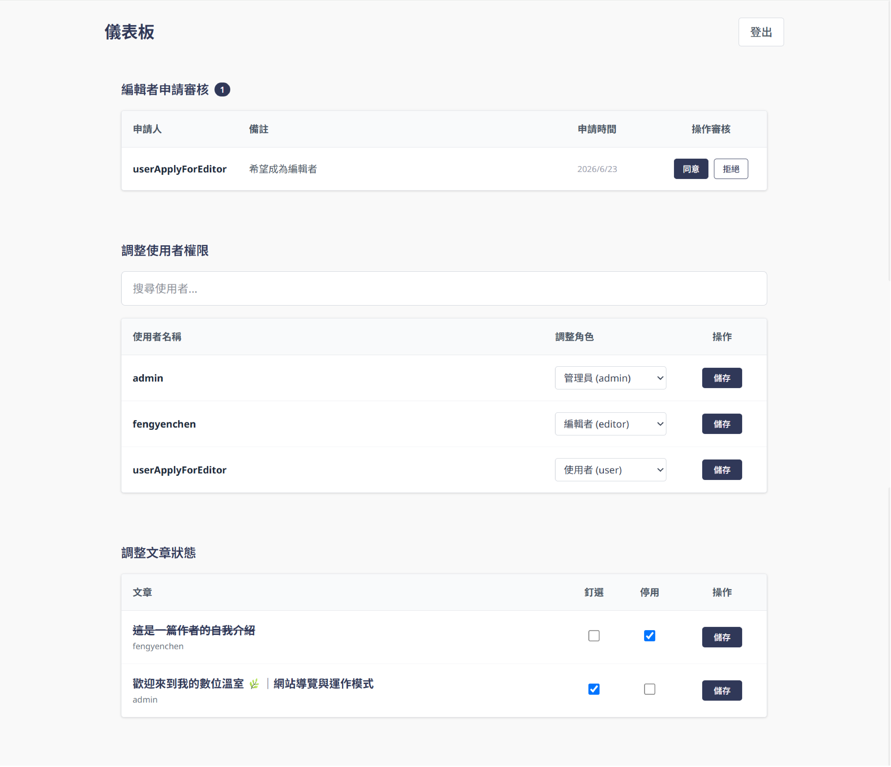
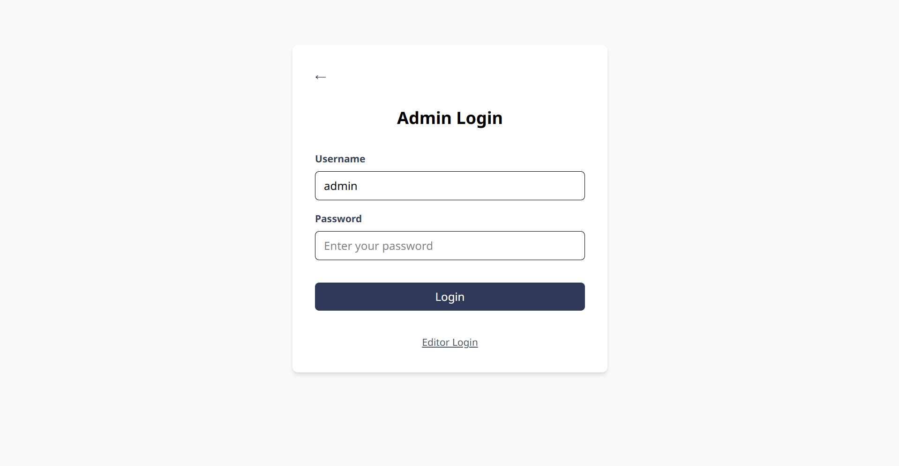
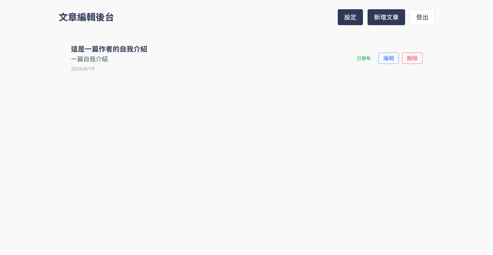
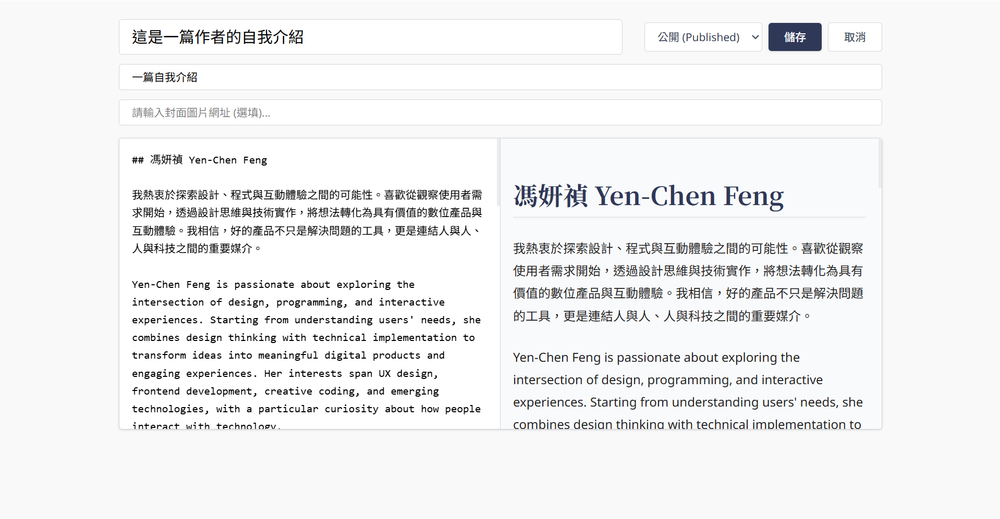
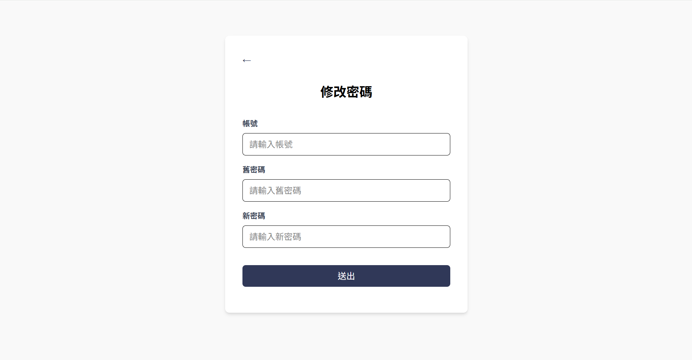
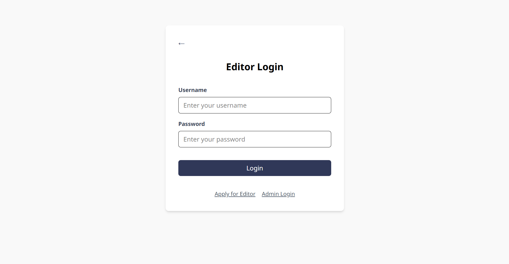
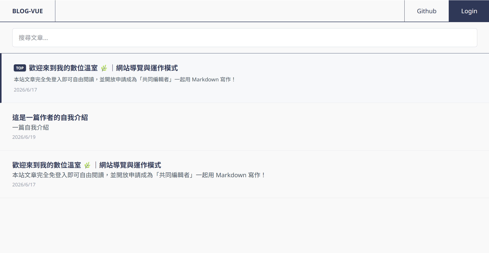
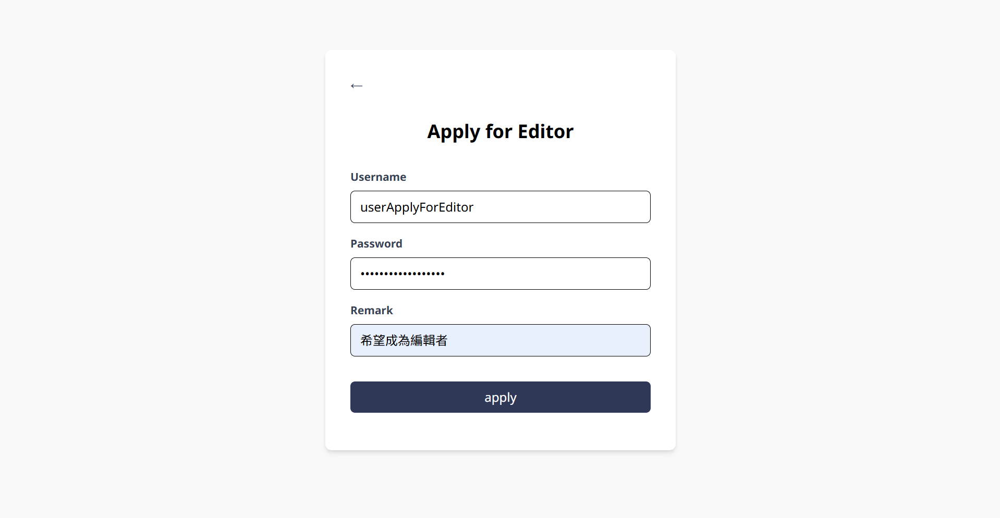

# Blog-Vue

基於 Vue 生態系開發的全端網頁應用，前台提供具備流暢響應式設計的內容閱讀介面，後台則整合 Markdown 解析器與即時預覽功能，實現現代化的內容管理系統。

---

## 核心特色

- **快速開發**：使用 Vite 建立開發環境，支援快速啟動與熱更新。
- **Vue 3 架構**：以 Vue 3 Single File Components (SFC) 撰寫頁面與元件。
- **Tailwind CSS**：透過 `@tailwindcss/vite` 整合 Tailwind CSS 進行現代化切版。
- **多角色權限控制**：嚴格劃分 `user` (一般讀者)、`editor` (文章編輯者)、`admin` (管理員) 三種角色權限。
- **全域路由守衛**：採用全域前置守衛攔截非法請求，防止未授權訪客或權限不足之角色透過手動輸入網址強行進入後台。
- **Markdown 編輯**：後台整合 `md-editor-v3`，提供 Markdown 編輯與雙欄即時預覽；文章正文會以 Markdown 原文儲存在資料庫。
- **前後台頁面分離**：`src/views/frontend` 存放前台公開頁面，`src/views/admin` 存放後台管理頁面。
- **Node.js API**：`server/` 提供 Express + PostgreSQL 後端，前端透過 `VITE_API_BASE_URL` 取得文章與驗證資料。

---

## 專案結構

```text
blog-vue/
├── dist/                # 前端打包後的正式環境產出物
├── node_modules/        # 專案依賴套件套件庫
├── public/              # 公開靜態資源
├── server/
│   ├── config/
│   │   └── env.js       # 載入 server/.env 的後端環境設定
│   ├── db/
│   │   └── pool.js      # PostgreSQL 連線池
│   ├── middleware/
│   │   └── auth.js      # JWT 驗證與角色權限 middleware
│   ├── routes/
│   │   ├── admin.js     # 管理員 API 路由
│   │   ├── auth.js      # 身分驗證 API 路由
│   │   ├── editor.js    # 編輯者 API 路由
│   │   ├── posts.js     # 文章 API 路由
│   │   └── users.js     # 使用者管理 API 路由
│   ├── .env             # 後端環境變數
│   ├── .env.example     # 後端環境變數範例
│   ├── index.js         # Express 後端主入口
│   ├── package.json     # 後端獨立部署的套件設定
│   └── vercel.json      # 後端 Vercel Serverless 設定
├── src/
│   ├── assets/          # 前端靜態資源
│   │   └── style/
│   │       └── markdown.css # 自訂 Markdown 樣式
│   ├── components/      # 前端共用元件
│   │   ├── AdjustUserRoles.vue   # 調整使用者權限元件
│   │   ├── Back.vue              # 返回上一頁元件
│   │   ├── BackToTop.vue         # 回到頂部元件
│   │   ├── EditorApplication.vue # 編輯者申請資料元件
│   │   ├── Navbar.vue            # 全站導覽列元件
│   │   ├── Posts.vue             # 文章列表元件
│   │   ├── SearchPosts.vue       # 搜尋文章元件
│   │   └── SearchUsers.vue       # 搜尋使用者元件
│   ├── lib/             # 前端共用工具函式 (utils)
│   │   ├── formatDate.ts         # 日期格式化工具
│   │   └── markdown.ts           # Markdown 解析工具
│   ├── router/
│   │   └── index.ts     # Vue Router 路由配置與全域路由守衛
│   ├── services/        # 負責與後端 API 對接的非同步請求服務
│   │   ├── admin.ts     # 管理員服務
│   │   ├── api.ts       # API 基底網址與共用 fetch 封裝
│   │   ├── auth.ts      # 登入驗證服務
│   │   ├── editor.ts    # 編輯者服務
│   │   ├── posts.ts     # 文章資料服務
│   │   └── users.ts     # 使用者資料服務
│   ├── types/           # 前端 TypeScript 型別定義
│   │   ├── auth.ts              # 驗證與用戶角色相關型別
│   │   ├── editorApplication.ts # 編輯者申請相關型別
│   │   └── post.ts              # 文章結構相關型別
│   ├── views/
│   │   ├── admin/       # 後台管理頁面
│   │   │   ├── AdminLoginView.vue   # 管理員登入
│   │   │   ├── Dashboard.vue        # 管理員主儀表板
│   │   │   ├── EditFormView.vue     # 文章新增/編輯表單頁面
│   │   │   ├── EditorSettingsView.vue # 編輯者個人設定頁面（如修改密碼等）
│   │   │   ├── EditorView.vue       # 編輯者專屬管理後台
│   │   │   └── LoginView.vue        # 編輯者登入
│   │   └── frontend/    # 前台公開頁面
│   │       ├── ApplyForEditorView.vue # 申請成為編輯者頁面
│   │       ├── HomeView.vue           # 部落格首頁
│   │       └── PostView.vue           # 單篇文章詳細閱讀頁
│   ├── App.vue          # 應用程式根元件
│   ├── main.ts          # Vue 專案啟動入口檔 (TypeScript)
│   └── style.css        # 全域樣式與 Tailwind 核心配置
├── .env                 # 前端環境變數
├── .env.example         # 前端環境變數範例模板
├── .gitignore           # Git 忽略檔案清單
├── index.html           # 前端單頁網頁 (SPA) 模板入口
├── init.sql             # PostgreSQL 資料庫初始化建表腳本
├── package-lock.json    # 精確鎖定套件版本紀錄檔
├── package.json         # 專案套件依賴與 npm scripts 指令配置
├── README.md            # 專案說明文件
├── tsconfig.app.json    # 前端應用程式 TS 設定
├── tsconfig.json        # TypeScript 主設定檔
├── tsconfig.node.json   # Vite 環境節點 TS 設定
├── vercel.json          # 前端 Vercel 設定
└── vite.config.ts       # Vite 核心建置與外掛設定
```

---

## 快速開始

### 1. 安裝 Node.js

先安裝 Node.js，建議使用 LTS 版本。

### 2. 安裝專案依賴

```bash
npm install
```

### 3. 設定環境變數

前端與後端分開部署，因此各自使用環境變數檔案。

可分別參考 `.env.example` 與 `server/.env.example` 建立檔案。

前端在專案根目錄建立 `.env`，後端在 `server/` 目錄建立 `.env` 

### 4. 資料庫初始化與建立 Admin 帳號

本專案的身分驗證全面採用 `bcrypt` 進行密碼雜湊加密。新配置開發環境時，請依循以下步驟初始化資料庫並建立管理員`（admin）`帳號：

#### 步驟 A：執行初始化腳本

使用專案根目錄下的 `init.sql` 檔案，在 PostgreSQL 中建立對應的資料表（`users`, `posts`, `editor_applications`）。

#### 步驟 B：產生 Admin 密碼的 Bcrypt 雜湊值

**絕對不能**直接將明文密碼寫入資料庫的 `password_hash` 欄位。請在終端機執行以下指令，利用 Node.js 快速計算出加密後的雜湊字串（請將 `'你的管理員密碼'` 替換成你想設定的密碼）：

```bash
node -e "console.log(require('bcrypt').hashSync('你的管理員密碼', 10))"
```

*執行後會輸出一個以 `$2b$10$` 開頭、長度為 60 個字元的加密字串。*

#### 步驟 C：手動插入 Admin 資料

打開你的資料庫管理工具，執行以下 SQL 語法手動建立 `admin` 帳號（請將剛剛產生的雜湊字串貼入 `password_hash`）：

```sql
INSERT INTO public.users (username, password_hash, role) 
VALUES ('admin', '把步驟 B 產生的雜湊字串貼在這裡', 'admin');

```

### 5. 啟動前後端開發伺服器

```bash
npm run dev
```

這個指令會同時啟動 Vite 前端與 Express API 伺服器。

---

## API 預設路由

* `GET /api/health`：檢查 API 是否啟動。

### 身分驗證模組

* `POST /api/auth`：使用者登入驗證。需在 body 帶入 `{ username, password }`。驗證成功回傳 JWT 與使用者資訊，失敗回傳 `401`。
* `POST /api/auth/apply-for-editor`：送出編輯者申請。需在 body 帶入 `{ username, password, remark }`。
* `POST /api/auth/change-password`：修改目前登入者的密碼。需在 body 帶入 `{ password, newPassword }`，並附帶 JWT。僅限 `admin` 或 `editor`。


### 文章模組

* `GET /api/posts`：取得所有已發布的文章列表（狀態為 `published`，依時間降冪排序）。
* `GET /api/posts/post/:id`：取得單篇已發布文章的詳細內容。

### 使用者管理模組

* `GET /api/users`：取得系統所有使用者列表（包含 ID、名稱與角色），僅限管理員 JWT。
* `GET /api/users/:id`：透過 ID 取得指定使用者的公開基本資料，供文章顯示作者名稱。

### 後台編輯者管理模組

* `GET /api/editor/posts`：取得目前登入編輯者的文章列表（包含草稿與已發布），需附帶 editor 或 admin JWT。
* `GET /api/editor/edit/:id`：取得單一文章詳細內容，僅限文章作者或管理員。
* `POST /api/editor/edit`：儲存新增文章。需在 body 帶入 `{ title, content, status, cover_image, excerpt }`；文章作者由 JWT 決定。
* `PUT /api/editor/edit/:id`：儲存更新文章。需在 body 帶入 `{ title, content, status, cover_image, excerpt }`；僅限文章作者或管理員。
* `DELETE /api/editor/edit/:id`：刪除指定文章，僅限文章作者或管理員。

### 後台管理員權限模組

* 所有 `/api/admin/*` 路由皆須附帶 admin JWT。
* `GET /api/admin/editor-applications`：取得所有編輯者資格申請紀錄。
* `GET /api/admin/editor-applications/pending`：僅取得處於「待審核（`pending`）」狀態的編輯者申請。
* `PUT /api/admin/editor-applications/:id/:status`：審核編輯者申請，變更狀態為 `approved` 或 `rejected`。
* `POST /api/admin/users/:userId/:role`：調整指定使用者的權限角色（`user` / `editor` / `admin`）。
* `PUT /api/admin/posts/:postId/status`：調整文章狀態（`is_pinned` / `is_disabled`）。

---

## 身分驗證與路由安全機制

本專案實作了嚴格的前後台角色分離防禦機制，核心邏輯如下：

1. **憑證管理**：使用者登入成功後，前端只會將有效期為 24 小時的 JWT 寫入 `localStorage` 的 `token`。每個受保護 API 請求會在 `Authorization` header 帶入 `Bearer <token>`；後端驗證 token 的使用者 ID 與角色，絕不信任前端傳送的角色或使用者 ID。
2. **全域前置守衛 (`router.beforeEach`)**：
* **無權限攔截**：一般未登入的訪客 (或一般讀者) 嘗試透過網址直接訪問後台管理（`/admin` 或 `/editor`）時，守衛會自動識別目標路徑，精確重導向至對應的登入頁面（`LoginView` 或 `AdminLoginView`）。
* **越權攔截**：已登入的角色若企圖跨越權限界線（例如 `editor` 試圖進入 `/admin/dashboard`），守衛將彈出「權限不足」提示，並自動將其彈回所屬的合法操作區域。
* **強制登出分離**：為了落實「後台人員需先登出才能回到前台」的專屬設計，當已登入的 `admin` 或 `editor` 主動切換至不需要驗證的公開頁面（如首頁 `home`、申請頁 `applyForEditor` 或登入頁）時，守衛會自動清除 `localStorage` 中的身分憑證，確保其以乾淨的普通訪客狀態回歸前台。

---

## 文章資料格式

* 後台編輯器輸入與調整之正文皆為 Markdown 格式。
* 資料庫的 `public.posts.content` 欄位完整儲存 Markdown 原文字串。
* 前台文章頁面（`PostView.vue`）渲染時，前端會透過轉換套件將 Markdown 原文即時編譯為語意化 HTML 結構，並套用 `src/assets/style/markdown.css` 進行排版美化。

---

## 資料庫結構

本專案採用 **PostgreSQL** 作為關聯式資料庫（RDBMS）基礎架構。系統啟用 `uuid-ossp` 擴充功能，所有主鍵（`id`）皆採用 `UUID` 自動生成，確保資料的唯一性與高擴充性。各資料表之間的約束與關聯設計如下：

### 實體關係圖概要 (ERD)

* `users.id` (1) <------- (N) `posts.user_id` *(外鍵約束，串聯刪除)*
* `users.id` (1) <------- (N) `editor_applications.user_id` *(外鍵約束，串聯刪除)*

---

### 1. 使用者資料表 (`public.users`)

儲存全站使用者的核心帳號憑證與 RBAC 權限角色。

| 欄位名稱 | 資料型態 | 特性 / 約束 | 預設值 / 說明 |
| --- | --- | --- | --- |
| `id` | `UUID` | `PRIMARY KEY` | `gen_random_uuid()`，使用者唯一識別碼 |
| `username` | `TEXT` | `NOT NULL`, `UNIQUE` | 登入帳號（信箱），不可重複 |
| `password_hash` | `TEXT` | `NOT NULL` | 加密後的密碼雜湊值 |
| `role` | `TEXT` | `NOT NULL` | `'user'` (預設一般讀者) / `'editor'` / `'admin'` |
| `created_at` | `TIMESTAMPTZ` | `NOT NULL` | `now()`，帳號註冊建立時間 |
| `updated_at` | `TIMESTAMPTZ` | `NOT NULL` | `now()`，帳號最後資料更新時間 |

### 2. 文章資料表 (`public.posts`)

儲存後台發布的所有部落格文章內容。

| 欄位名稱 | 資料型態 | 特性 / 約束 | 預設值 / 說明 |
| --- | --- | --- | --- |
| `id` | `UUID` | `PRIMARY KEY` | `gen_random_uuid()` |
| `user_id` | `UUID` | `NOT NULL`, `FOREIGN KEY` | 指向 `users(id)`，當使用者被刪除時自動引發 `ON DELETE CASCADE` 串聯刪除 |
| `title` | `TEXT` | `NOT NULL` | 文章標題 |
| `content` | `TEXT` | `NOT NULL` | 文章正文（以 Markdown 原文字串存放） |
| `excerpt` | `TEXT` | `NULL` | 文章摘要，若未填寫則由系統自動擷取正文前 100 字 |
| `cover_image` | `TEXT` | `NULL` | 封面圖之網址或路徑 |
| `status` | `TEXT` | `NOT NULL` | `'draft'` (預設草稿) / `'published'` (已發布) |
| `created_at` | `TIMESTAMPTZ` | `NOT NULL` | `now()`，文章初次建立時間 |
| `updated_at` | `TIMESTAMPTZ` | `NOT NULL` | `now()`，文章最後修改時間 |
| `is_pinned` | `BOOLEAN` | `NULL` | `false`，是否釘選 / 置頂文章 |
| `is_disabled` | `BOOLEAN` | `NULL` | `false`，是否停用 / 封鎖文章 |

### 3. 編輯者申請紀錄表 (`public.editor_applications`)

儲存一般使用者（`user`）提升權限至編輯者（`editor`）的審核流水帳。

| 欄位名稱 | 資料型態 | 特性 / 約束 | 預設值 / 說明 |
| --- | --- | --- | --- |
| `id` | `UUID` | `PRIMARY KEY` | `gen_random_uuid()` |
| `user_id` | `UUID` | `NOT NULL`, `FOREIGN KEY` | 指向 `users(id)`，支持 `ON DELETE CASCADE` |
| `remark` | `TEXT` | `NULL` | 申請人填寫的申請理由或備註 |
| `status` | `TEXT` | `NOT NULL` | `'pending'` (預設待審核) / `'approved'` / `'rejected'` |
| `created_at` | `TIMESTAMPTZ` | `NULL` | `NOW()`，提交申請時間 |
| `updated_at` | `TIMESTAMPTZ` | `NULL` | `NOW()`，管理員最後審核變更時間 |

---

## 建置與部署

### 建置正式版本

```bash
npm run build
```

### 預覽正式版本

```bash
npm run preview
```

---

## 部署架構與環境變數設定

本專案以前後端分離方式部署；前端會直接呼叫後端 API，後端使用 CORS 僅允許指定的前端網域。

* **前端網頁 (Client)**：部署於 **Vercel** 平台（專案名稱：`blog-vue`）。
* **後端 API (Server)**：同樣部署於 **Vercel** 平台（專案名稱：`blog-vue-api`），採用 Serverless Functions 架構運作。
* **雲端資料庫 (Database)**：託管於 **Neon** 平台，提供具備自動休眠與連線池優化的 PostgreSQL 服務。

### Vercel 部署設定

#### 前端 Vercel 專案

設定以下 Environment Variable：

```env
VITE_API_BASE_URL=https://你的後端網址.vercel.app/api
```

#### 後端 Vercel 專案

將 Vercel 專案的 Root Directory 設為 `server`，此資料夾內的 `vercel.json` 會把請求交給 `index.js` 的 Express API。設定以下 Environment Variables：

```env
DATABASE_URL=你的 Neon PostgreSQL 連線字串
JWT_SECRET=與本機 server/.env 相同的長隨機密鑰
FRONTEND_ORIGIN=https://你的前端網址.vercel.app
```

#### 本機開發

```env
# .env（前端）
VITE_API_BASE_URL=http://localhost:3000/api

# server/.env（後端）
PORT=3000
FRONTEND_ORIGIN=http://localhost:5173
DATABASE_URL=你的 Neon PostgreSQL 連線字串
JWT_SECRET=長隨機密鑰
```

---

## 系統介面預覽

### 1. 後台管理員與編輯者介面

#### 管理員儀表板
`admin` 角色的主要後台，用於管理全站文章、審核申請與調整使用者權限。


#### 管理員登入
供管理員（`admin`）進入系統後台的登入入口。


#### 編輯者後台
`editor` 角色的後台，可查看並管理自己所撰寫的所有文章列表。


#### 文章新增與編輯表單
整合 `md-editor-v3` 的 Markdown 編輯器，支援雙欄即時預覽與文章儲存。


#### 編輯者密碼修改
提供編輯者在後台安全變更密碼的功能。


#### 編輯者登入
供編輯者（`editor`）進入後台的登入介面。


---

### 2. 前台公開與申請介面

#### 文章區
編輯者或管理員(登入編輯者介面)寫的文章。


#### 申請成為編輯者頁面
供一般讀者填寫以提升權限為 `editor` 的表單。

